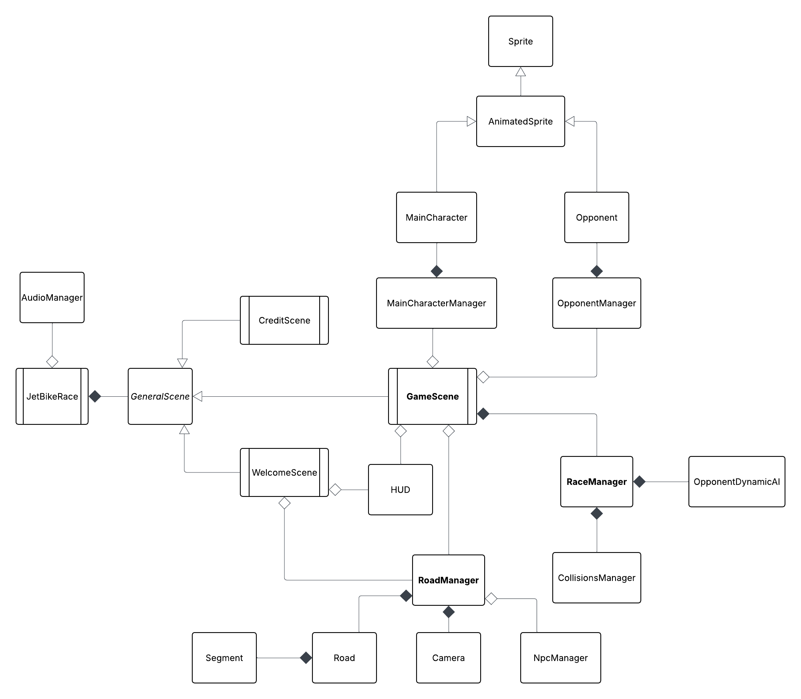

# Architecture

## Overview

The application is structured as a **JavaFX monolithic application** with a scene-based architecture.

All components are part of the same codebase and interact directly through object references. This design choice simplifies development and allows tight coordination between rendering, game logic, and input handling.

---

## Core Components

### GameScene

The central component of the application.

Responsibilities:

- manages the main game loop via `AnimationTimer`
- handles user input
- updates game state at each frame
- coordinates all main managers
- computes score and race state

---

### RoadManager

Core of the rendering system.

Responsibilities:

- manages the road structure (segments)
- handles pseudo-3D projection
- renders:
  - road
  - background
  - racers
  - decorations
- determines visible segments based on camera position

---

### RaceManager

Handles game logic.

Responsibilities:

- manages race progression
- handles collisions
- controls speed dynamics
- determines race outcome (win/lose)
- coordinates opponent AI

---

### Supporting Components

- **MainCharacterManager** → player movement and rendering  
- **OpponentManager** → opponent state and rendering  
- **NpcManager** → dynamic obstacle generation  
- **CollisionsManager** → collision detection and response  
- **AudioManager** → music and sound effects  
- **HUD** → score and minimap visualization  

---

## Rendering Pipeline

The pseudo-3D effect is achieved through:

1. **Segment-based road representation**
2. **Camera-relative coordinate transformation**
3. **Perspective projection (depth-based scaling)**
4. **Screen-space conversion**

Each segment is projected from 3D space into 2D canvas coordinates, creating a depth illusion.

---

## Game Loop

The game loop is driven by JavaFX's `AnimationTimer`:

- update game state  
- compute positions and collisions  
- render frame  

This ensures real-time interaction and smooth animation.

---

## UML Diagrams

### High-level overview

---

### Detailed views

- GameScene → `uml/uml-gamescene.png`
- RoadManager → `uml/uml-roadmanager.png`
- RaceManager → `uml/uml-racemanager.png`

---

## Limitations

The current architecture is monolithic:

- strong coupling between components  
- limited scalability  
- harder to isolate bugs in large systems  

---

## Future Improvements

- modularization of components  
- decoupling rendering from game logic  
- reusable pseudo-3D rendering engine  
- improved maintainability and scalability  